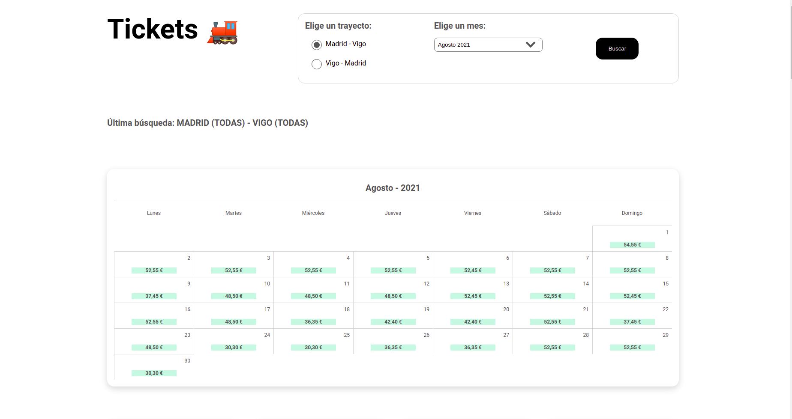

# Tracks tickets Vigo-Madrid-Vigo

El objetivo de esta aplicación es poder tener de un solo vistazo todos los billetes del mes corriente o, de algún otro mes del año actual, en un trayecto concreto, en este caso, de Vigo a Madrid o de Madrid a Vigo.

En la parte superior de la vista principal se renderizará un calendario con el precio del billete más barato para el trayecto y mes seleccionado.

## ¿Cómo funciona?

1. Descárgate la aplicación e instálate las dependecias: `npm install`
2. Levanta la aplicación: `npm start`
3. Selecciona el trayecto que quieres, Vigo-Madrid o Madrid-Vigo y haz click en 'Buscar'
4. Comprueba como se levanta un navegador (Chromium)
